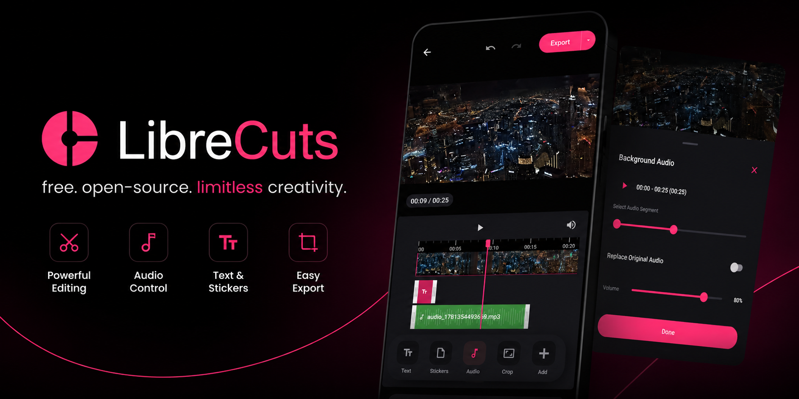
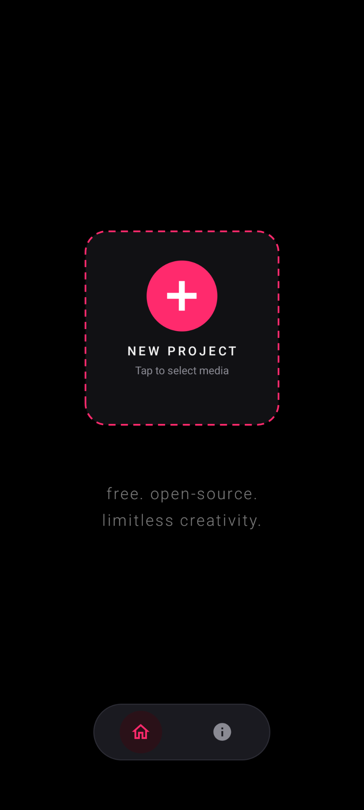
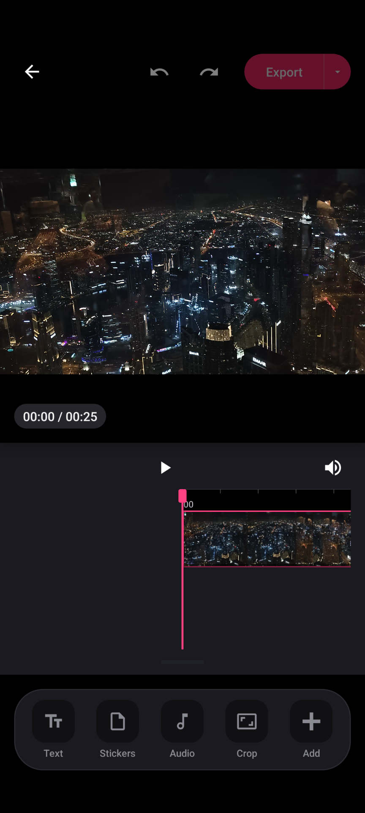
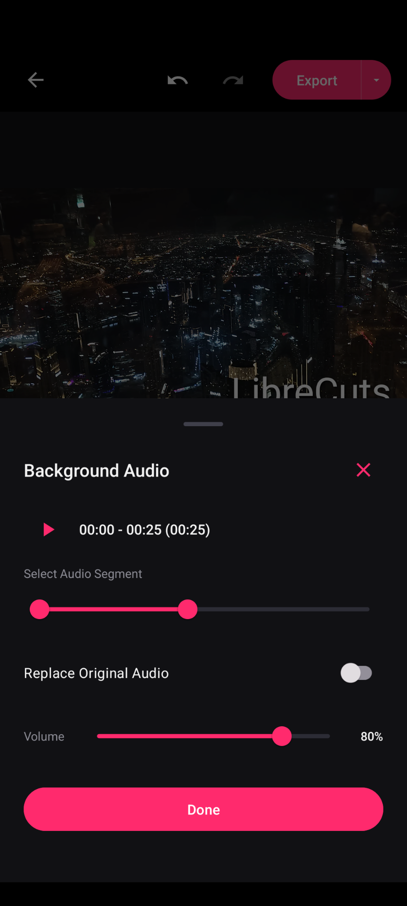
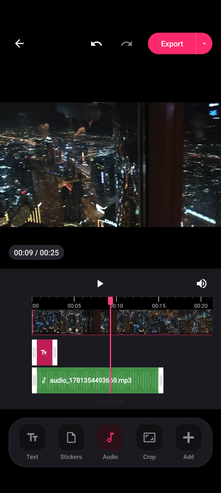

# OrbitFlow AI

<div align="center">
  
  <br/>
  <br/>

  <a href="LICENSE">
    
  </a>
  <a href="https://github.com/Ankush247-ship/OrbitFlowAI/actions/workflows/ci.yml">
    
  </a>
  <br/>
  <br/>
</div>

<br/>

**OrbitFlow AI** is a premium video editor for Android by **Orbit Pixel Studio**, built for simplicity, performance, and privacy. Edit and export watermark-free videos directly on your device.

## 📥 Download

- **Debug builds**: Every push to `main` automatically builds a debug APK via [GitHub Actions](https://github.com/Ankush247-ship/OrbitFlowAI/actions/workflows/ci.yml). Open the latest successful run and download the `app-debug-*` artifact.
- **Signed releases**: Push a git tag like `v1.0-beta6` (matching `versionName` in `app/build.gradle`) to trigger the [release workflow](.github/workflows/release.yml), which builds, signs, and publishes a GitHub Release with the APK attached.

---

## 🚀 Features

- **Trim** - Remove unwanted parts from the beginning or end of a video clip with a real-time timeline control.
- **Overlays** - Place text, stickers, images, GIFs, and video overlays on top of video clips to create engaging content. Includes support for continuous media looping.
- **Masking** - Apply various mask shapes to your overlays for creative effects.
- **Chroma Key** - Remove backgrounds from any overlay using the green screen effect.
- **Keyframes** - Animate overlays across the screen with keyframe support.
- **Subtitles (Captions)** - Import custom `.srt` subtitle files with a dedicated toolbar slider for resizing and fully interactive touch-based positioning directly on the video preview.
- **Layer Management** - Easily reorder overlay layers to control what renders on top.
- **Audio** - Manage soundtracks effortlessly by importing custom music or audio tracks, recording voice overs, applying audio ducking and fades, amplifying volume up to 200%, and muting original audio.
- **Audio Export** - Export your project's entire audio mix as a standalone MP3 file.
- **Snapshots** - Capture and save high-quality frame grabs (snapshots) directly from the video editor.
- **Crop** - Adjust the aspect ratio of a video with custom cropping support.
- **Merge** - Combine multiple video segments into a continuous sequence with drag-to-rearrange functionality.
- **Transition** - Apply transitions with animated visual previews in the toolbar.
- **Speed** - Change the speed of a video clip using a custom speed slider for granular control.
- **Adjust & Filters** - Modify video brightness, contrast, saturation, and apply color filters.
- **Canvas Background** - Add a blurred background or a solid color for a cohesive look when your video aspect ratio does not match the project frame.
- **Reverse** - Reverse video playback.
- **Timeline Organization** - Enhanced editing with snapping functionality, overlay duplication, freeze frame actions, and improved UI visual styling.
- **Hardware Acceleration** - Super-fast and reliable video exports using device hardware-accelerated `h264_mediacodec` encoding (with seamless automatic fallback to software encoding for maximum device compatibility) and accurate FFmpeg progress calculation.

## 📱 Screenshots

<div align="center">
  <table>
    <tr>
      <td align="center"></td>
      <td align="center"></td>
      <td align="center"></td>
      <td align="center"></td>
    </tr>
    <tr>
      <td align="center"><b>Home Screen</b></td>
      <td align="center"><b>Editor Screen</b></td>
      <td align="center"><b>Audio Import</b></td>
      <td align="center"><b>Timeline</b></td>
    </tr>
  </table>
</div>

## 💖 Support OrbitFlow AI

OrbitFlow AI is built by Orbit Pixel Studio. If the app has helped you create great videos, consider upgrading to Pro to support continued development.

## 🛠️ Getting Started

### Prerequisites

- Android Studio
- Android SDK

### Installation

1. **Clone the repository**:
   ```bash
   git clone https://github.com/Ankush247-ship/OrbitFlowAI.git
   ```
2. **Open the project in Android Studio**:
   - Launch Android Studio and select "Open an existing Android Studio project."
   - Navigate to the cloned directory and select it.
3. **Build the project**:
   - Click on "Build" in the menu, then select "Make Project."
4. **Run the app**:
   - Connect an Android device or start an emulator.
   - Click on the "Run" button in Android Studio.

## 🔒 Permissions

OrbitFlow AI requires the following permissions to function properly:

- **READ_EXTERNAL_STORAGE**: To read videos from the device.
- **WRITE_EXTERNAL_STORAGE**: (For older Android versions) To save edited videos.
- **POST_NOTIFICATIONS**: To show notifications related to video editing.
- **READ_MEDIA_AUDIO/VIDEO/IMAGES**: For accessing media files on devices running Android 13 (API level 33) and above.

## 🔧 Troubleshooting & Support

If you encounter any export failures, codec errors, or unexpected crashes during your editing workflow:
- Refer to our [Error Codes & Troubleshooting Guide](https://orbitpixelstudio.com/help/error-codes).
- Reach out via [Contact Us](https://orbitpixelstudio.com) for support, suggestions, and app updates.

## 🤝 Contributing

Contributions are welcome! If you have suggestions or improvements, feel free to create a pull request or open an issue.

1. Fork the repository.
2. Create a new branch for your feature or bug fix.
3. Commit your changes.
4. Push to the branch.
5. Submit a pull request.

## 📝 License

This project is licensed under the MIT License. See the [LICENSE](LICENSE) file for details. OrbitFlow AI is built on top of an MIT-licensed open-source video editor codebase; the original copyright notice is preserved in the LICENSE file as required by the license.
